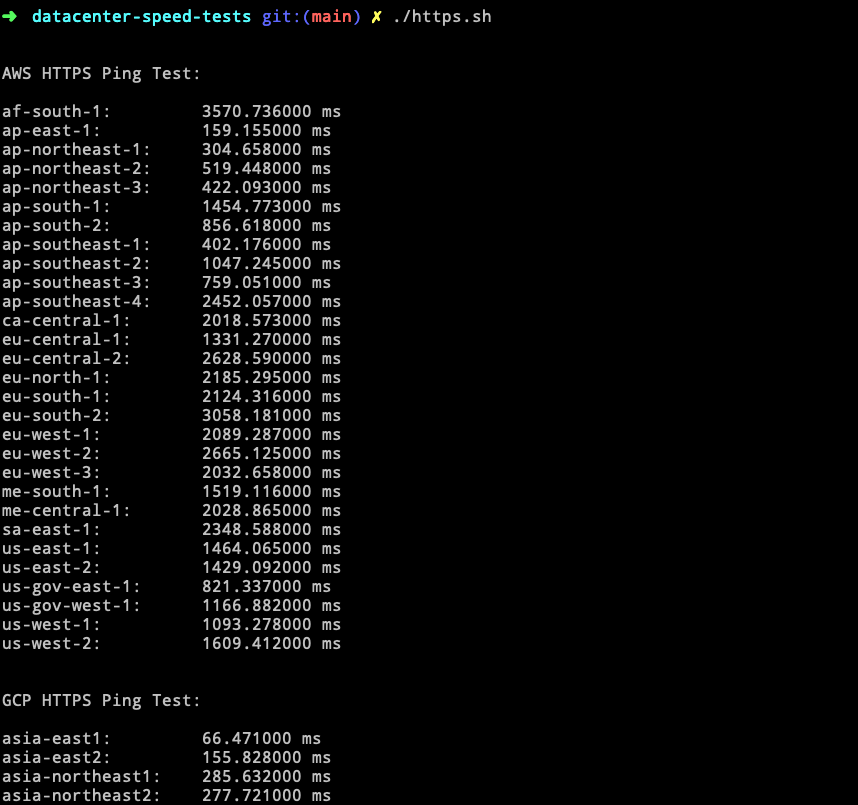

# ICMP Ping Tests and HTTPS Ping Tests for Cloud Providers

This is a simple script to test the speed of the datacenter.

## Usage

If you trust me (which you shouldn't, _please_ don't trust random people on the internet!) these commands will download and run the scripts automatically:

```bash
# wget
wget -qO - https://raw.githubusercontent.com/tpai/datacenter-speed-tests/master/ping.sh | bash
wget -qO - https://raw.githubusercontent.com/tpai/datacenter-speed-tests/master/https.sh | bash

# curl
curl -s https://raw.githubusercontent.com/tpai/datacenter-speed-tests/master/ping.sh | bash
curl -s https://raw.githubusercontent.com/tpai/datacenter-speed-tests/master/https.sh | bash
```

Or, clone the repository and make sure the scripts are executable before running:

```bash
git clone https://github.com/tpai/datacenter-speed-tests.git
cd datacenter-speed-tests
chmod +x ping.sh && chmod +x https.sh
./ping.sh
./https.sh
```


## Providers & Regions

Scripts will test ICMP pings to the following data centers:

#### [DigitalOcean](https://www.digitalocean.com/docs/platform/availability-matrix/#datacenter-regions)

- NYC1
- NYC2
- NYC3
- SFO1
- SFO2
- SFO3
- TOR1
- LON1
- FRA1
- AMS2
- AMS3
- SGP1
- BLR1

#### [Linode](https://www.linode.com/global-infrastructure/)

- Newark
- Atlanta
- Dallas
- Fremont
- London
- Frankfurt
- Singapore
- Tokyo
- Sydney
- Toronto
- Mumbai

#### [Amazon Web Services](https://docs.aws.amazon.com/AmazonRDS/latest/UserGuide/Concepts.RegionsAndAvailabilityZones.html)

- af-south-1
- ap-east-1
- ap-northeast-1
- ap-northeast-2
- ap-northeast-3
- ap-south-1
- ap-south-2
- ap-southeast-1
- ap-southeast-2
- ap-southeast-3
- ap-southeast-4
- ca-central-1
- eu-central-1
- eu-central-2
- eu-north-1
- eu-south-1
- eu-south-2
- eu-west-1
- eu-west-2
- eu-west-3
- me-central-1
- me-south-1
- sa-east-1
- us-east-1
- us-east-2
- us-gov-east-1
- us-gov-west-1
- us-west-1
- us-west-2

Scripts will test HTTPS pings to the following data centers:

#### [Amazon Web Services](https://docs.aws.amazon.com/AmazonRDS/latest/UserGuide/Concepts.RegionsAndAvailabilityZones.html)

- [same as above]

#### [Google Cloud](https://cloud.google.com/compute/docs/regions-zones/)

- asia-east1
- asia-east2
- asia-northeast1
- asia-northeast2
- asia-northeast3
- asia-south1
- asia-south2
- asia-southeast1
- asia-southeast2
- australia-southeast1
- australia-southeast2
- europe-central2
- europe-north1
- europe-southwest1
- europe-west1
- europe-west2
- europe-west3
- europe-west4
- europe-west6
- europe-west8
- europe-west9
- me-central1
- me-west1
- northamerica-northeast1
- northamerica-northeast2
- southamerica-east1
- southamerica-west1
- us-central1
- us-central1
- us-east1
- us-east4
- us-east5
- us-south1
- us-west1
- us-west1
- us-west2
- us-west3

### [Azure](https://azure.microsoft.com/en-us/explore/global-infrastructure/geographies/#geographies)

- Australia East
- Australia Southeast
- Brazil
- Canada Central
- Canada East
- Central India
- Central US
- East Asia
- East US
- East US 2
- France Central
- Germany North
- Japan East
- Japan West
- Korea Central
- Korea South
- Netherlands
- North Central US
- North Europe
- Norway East
- Poland Central
- Qatar Central
- South Africa North
- South Central US
- South India
- South UK
- Southeast Asia
- Southeast UK
- Switzerland North
- Switzerland West
- UAE North
- West Central US
- West Europe
- West India
- West UK
- West US
- West US 2
- West US 3

## Screenshots




---

Inspired by https://www.reddit.com/r/webdev/comments/6ylmki/heres_an_easy_way_to_find_the_nearest/
